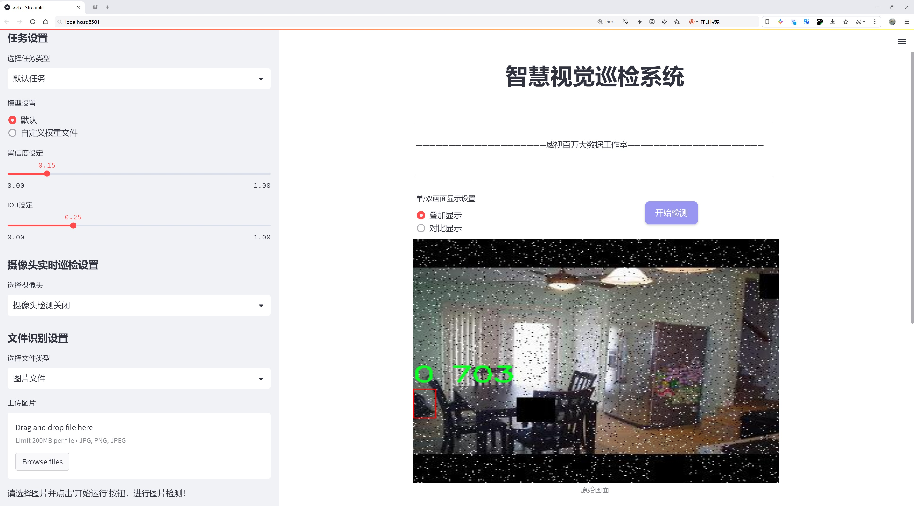
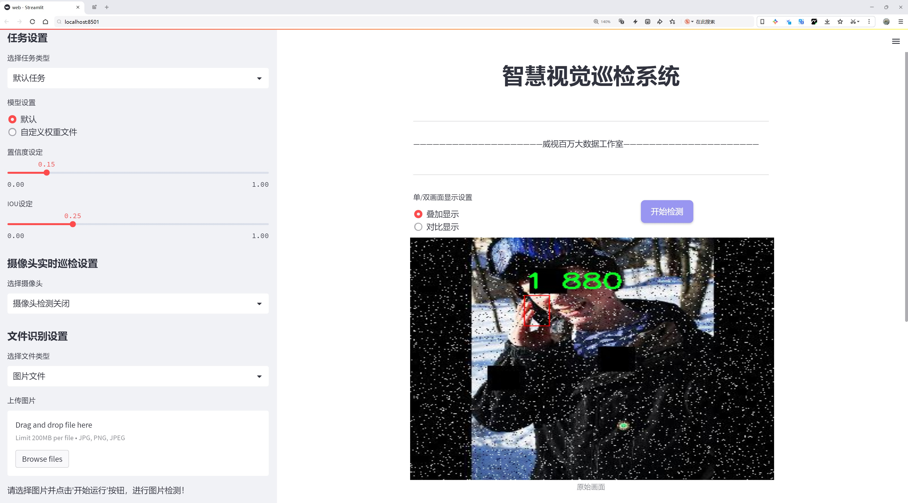
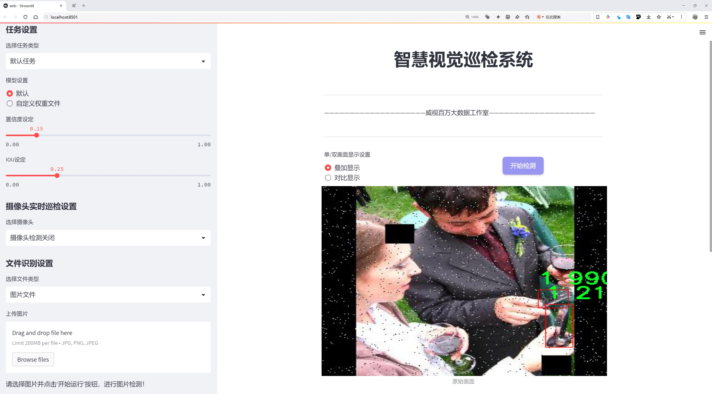
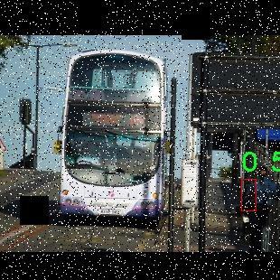
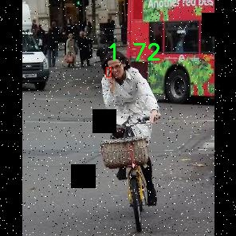
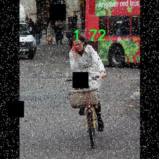
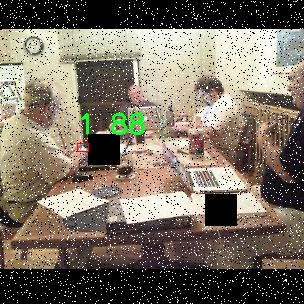
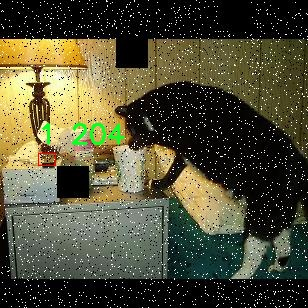

# 手机检测检测系统源码分享
 # [一条龙教学YOLOV8标注好的数据集一键训练_70+全套改进创新点发刊_Web前端展示]

### 1.研究背景与意义

项目参考[AAAI Association for the Advancement of Artificial Intelligence](https://gitee.com/qunmasj/projects)

项目来源[AACV Association for the Advancement of Computer Vision](https://kdocs.cn/l/cszuIiCKVNis)

研究背景与意义

随着智能手机的普及，手机检测技术在各个领域的应用需求日益增长，包括安全监控、智能零售、仓储管理等。传统的手机检测方法往往依赖于人工识别，效率低下且容易出错，难以满足现代社会对快速、准确识别的需求。因此，基于深度学习的目标检测技术应运而生，成为解决这一问题的重要手段。YOLO（You Only Look Once）系列模型以其高效的实时检测能力和较高的准确率，逐渐成为目标检测领域的研究热点。YOLOv8作为该系列的最新版本，具备了更强的特征提取能力和更快的推理速度，为手机检测系统的开发提供了良好的基础。

在本研究中，我们将重点关注基于改进YOLOv8的手机检测系统的构建。为此，我们使用了一个包含3066张图像的数据集，该数据集分为两个类别，分别代表不同类型的手机。这一数据集的构建为我们的研究提供了丰富的样本基础，使得模型能够在多样化的场景中进行训练和测试。数据集的规模和类别设置不仅能够有效提升模型的泛化能力，还能帮助我们深入分析不同手机在不同环境下的检测表现。

通过对YOLOv8模型的改进，我们期望在检测精度和速度上实现更好的平衡。传统YOLO模型在处理小物体时常常面临挑战，而手机作为相对较小的目标物体，其检测的准确性直接影响到整个系统的性能。因此，我们将针对YOLOv8的特征提取网络进行优化，引入多尺度特征融合技术，以增强模型对小型目标的检测能力。此外，针对手机在不同光照、角度和背景下的变化，我们还将采用数据增强技术，进一步丰富训练样本，提高模型的鲁棒性。

本研究的意义不仅在于提升手机检测的准确性和效率，更在于推动目标检测技术在实际应用中的落地。随着智能手机市场的不断扩大，基于改进YOLOv8的手机检测系统将为各类应用场景提供强有力的技术支持。例如，在智能零售领域，系统能够实时监测顾客的手机使用情况，帮助商家分析消费行为；在安全监控中，系统能够自动识别可疑的手机行为，提升公共安全防范能力。

综上所述，基于改进YOLOv8的手机检测系统的研究具有重要的理论价值和广泛的应用前景。通过对现有技术的改进与创新，我们希望能够为手机检测领域提供新的思路和方法，推动相关技术的进步与发展。

### 2.图片演示







##### 注意：由于此博客编辑较早，上面“2.图片演示”和“3.视频演示”展示的系统图片或者视频可能为老版本，新版本在老版本的基础上升级如下：（实际效果以升级的新版本为准）

  （1）适配了YOLOV8的“目标检测”模型和“实例分割”模型，通过加载相应的权重（.pt）文件即可自适应加载模型。

  （2）支持“图片识别”、“视频识别”、“摄像头实时识别”三种识别模式。

  （3）支持“图片识别”、“视频识别”、“摄像头实时识别”三种识别结果保存导出，解决手动导出（容易卡顿出现爆内存）存在的问题，识别完自动保存结果并导出到tempDir中。

  （4）支持Web前端系统中的标题、背景图等自定义修改，后面提供修改教程。

  另外本项目提供训练的数据集和训练教程,暂不提供权重文件（best.pt）,需要您按照教程进行训练后实现图片演示和Web前端界面演示的效果。

### 3.视频演示

[3.1 视频演示](https://www.bilibili.com/video/BV1LAsSeHEAB/)

### 4.数据集信息展示

##### 4.1 本项目数据集详细数据（类别数＆类别名）

train: ../train/images
val: ../valid/images
test: ../test/images

nc: 2
names: ['0', '1']

roboflow:
  workspace: super-fire
  project: phone-djeci
  version: 2
  license: CC BY 4.0
  url: https://universe.roboflow.com/super-fire/phone-djeci/dataset/2

##### 4.2 本项目数据集信息介绍

数据集信息展示

在本研究中，我们采用了名为“phone”的数据集，以训练和改进YOLOv8的手机检测系统。该数据集专门针对手机检测任务而设计，包含了丰富的图像数据，旨在提高模型在实际应用中的准确性和鲁棒性。数据集的结构清晰，分为训练集、验证集和测试集，分别存放在指定的路径下。训练集位于“../train/images”，验证集位于“../valid/images”，而测试集则在“../test/images”中。这种划分方式有助于模型在不同阶段的学习和评估，确保其在未见数据上的表现。

“phone”数据集包含两个类别，分别用数字“0”和“1”表示。这种简洁的类别设置使得模型能够快速学习并准确识别目标对象。在实际应用中，这两个类别可能分别代表不同类型的手机，例如智能手机与功能手机，或者是不同品牌的手机。通过这种方式，数据集不仅能够提供多样化的样本，还能帮助模型更好地理解和区分不同类型的手机，从而提升检测精度。

该数据集的创建和管理由一个名为“super-fire”的工作区负责，项目的名称为“phone-djeci”，目前版本为2。数据集遵循CC BY 4.0许可证，这意味着用户可以自由使用、修改和分发数据集，只需适当归属原作者。这种开放的许可证为研究人员和开发者提供了极大的便利，使得他们能够在此基础上进行进一步的研究和开发，推动手机检测技术的进步。

为了便于用户访问和使用，数据集提供了一个在线链接，用户可以通过访问该链接获取更多信息和下载数据集。这种透明性和可访问性不仅促进了学术界的合作与交流，也为相关领域的研究提供了丰富的资源支持。

在训练YOLOv8模型的过程中，数据集的质量和多样性至关重要。我们在选择“phone”数据集时，特别关注了图像的清晰度、标注的准确性以及样本的多样性。这些因素直接影响到模型的训练效果和最终的检测性能。通过对不同场景、不同光照条件下的手机图像进行收集和标注，我们确保了数据集的代表性，使得模型能够在各种实际环境中有效运行。

总之，“phone”数据集为改进YOLOv8的手机检测系统提供了坚实的基础。通过合理的划分、清晰的类别定义以及高质量的图像数据，该数据集不仅能够提升模型的检测能力，还能为后续的研究提供有力的支持。我们期待通过这一数据集的应用，推动手机检测技术的进一步发展，并为相关领域的研究者提供有价值的参考和借鉴。











### 5.全套项目环境部署视频教程（零基础手把手教学）

[5.1 环境部署教程链接（零基础手把手教学）](https://www.ixigua.com/7404473917358506534?logTag=c807d0cbc21c0ef59de5)


[5.2 安装Python虚拟环境创建和依赖库安装视频教程链接（零基础手把手教学）](https://www.ixigua.com/7404474678003106304?logTag=1f1041108cd1f708b01a)

### 6.手把手YOLOV8训练视频教程（零基础小白有手就能学会）

[6.1 手把手YOLOV8训练视频教程（零基础小白有手就能学会）](https://www.ixigua.com/7404477157818401292?logTag=d31a2dfd1983c9668658)

### 7.70+种全套YOLOV8创新点代码加载调参视频教程（一键加载写好的改进模型的配置文件）

[7.1 70+种全套YOLOV8创新点代码加载调参视频教程（一键加载写好的改进模型的配置文件）](https://www.ixigua.com/7404478314661806627?logTag=29066f8288e3f4eea3a4)

### 8.70+种全套YOLOV8创新点原理讲解（非科班也可以轻松写刊发刊，V10版本正在科研待更新）

由于篇幅限制，每个创新点的具体原理讲解就不一一展开，具体见下列网址中的创新点对应子项目的技术原理博客网址【Blog】：


[8.1 70+种全套YOLOV8创新点原理讲解链接](https://gitee.com/qunmasj/good)

### 9.系统功能展示（检测对象为举例，实际内容以本项目数据集为准）

图9.1.系统支持检测结果表格显示

  图9.2.系统支持置信度和IOU阈值手动调节

  图9.3.系统支持自定义加载权重文件best.pt(需要你通过步骤5中训练获得)

  图9.4.系统支持摄像头实时识别

  图9.5.系统支持图片识别

  图9.6.系统支持视频识别

  图9.7.系统支持识别结果文件自动保存

  图9.8.系统支持Excel导出检测结果数据


### 10.原始YOLOV8算法原理

原始YOLOv8算法原理

YOLOv8算法是由Ultralytics公司于2023年1月10日推出的最新版本，代表了YOLO系列目标检测算法的又一次重大进步。它在YOLOv7的基础上进行了多方面的优化，旨在提升目标检测的精度和速度。YOLOv8采用了更深的卷积神经网络结构，这使得它能够在复杂场景中更有效地进行目标检测和定位。与传统的滑动窗口或区域提议方法不同，YOLOv8将整个图像作为输入，直接在图像上进行目标检测，这种端到端的处理方式极大地提高了检测的效率。

YOLOv8的设计理念是基于卷积神经网络（CNN），它通过深度学习模型提取图像中的特征信息。YOLOv8的网络结构中引入了多个创新技术，例如多尺度训练和测试、特征金字塔网络（FPN）等。这些技术的结合使得YOLOv8在处理不同大小和形状的目标时表现得更加出色。特征金字塔网络的引入使得模型能够在不同的尺度上提取特征，从而增强了对小目标的检测能力。

在YOLOv8中，模型的骨干网络采用了跨阶段局部网络（CSP）结构，进一步优化了YOLOv5中的C3模块，替换为更轻量的C2f结构。这种结构的设计不仅保留了原有的特征提取能力，还通过增加跳层连接和Split操作，减少了计算复杂度，提高了模型的推理速度。此外，YOLOv8在头部结构上进行了重大变革，采用了解耦头（Decoupled Head），将目标检测中的分类和回归任务分开处理。这种方法消除了之前Anchor-Based的限制，使得YOLOv8能够在不依赖于锚框的情况下进行目标检测，从而提升了模型的灵活性和适应性。

YOLOv8的损失函数设计也进行了创新，采用了变焦损失（Focal Loss）来计算分类损失，并结合数据平均保真度损失和完美交并比损失来计算边界框损失。这种新颖的损失策略使得模型在训练过程中能够更好地关注难以检测的目标，从而提高了整体的检测精度。

在性能方面，YOLOv8相较于之前的版本在精度和帧率上均有显著提升。与SSD算法相比，YOLOv8的精度提高了43.23%，帧率则提升了10.28倍，这使得YOLOv8在实时目标检测任务中表现得尤为突出。YOLOv8的高效性和准确性使其在智能监控、自动驾驶、人脸识别等多个应用场景中得到了广泛的应用。

YOLOv8的多尺度训练和测试策略也为其在不同环境下的适应性提供了保障。通过在不同尺度上进行训练，模型能够学习到更丰富的特征信息，从而在实际应用中表现出更强的鲁棒性。此外，YOLOv8还支持高分辨率图像的检测，这对于需要高精度的任务尤为重要。

总的来说，YOLOv8作为YOLO系列的最新版本，凭借其深度优化的网络结构、创新的损失函数和高效的特征提取能力，成为了当前计算机视觉领域中最先进的目标检测模型之一。它的推出不仅推动了目标检测技术的发展，也为实际应用提供了更为强大的工具。随着YOLOv8的不断优化和迭代，未来在目标检测领域的应用前景将更加广阔。


### 11.项目核心源码讲解（再也不用担心看不懂代码逻辑）

#### 11.1 code\ultralytics\models\sam\modules\sam.py

以下是对给定代码的核心部分进行分析和详细注释的结果：

```python
# 导入必要的库
from typing import List
import torch
from torch import nn

# 导入解码器和编码器
from .decoders import MaskDecoder
from .encoders import ImageEncoderViT, PromptEncoder

class Sam(nn.Module):
    """
    Sam（Segment Anything Model）旨在进行对象分割任务。它使用图像编码器生成图像嵌入，并使用提示编码器对各种类型的输入提示进行编码。
    这些嵌入随后被掩码解码器用于预测对象掩码。

    属性：
        mask_threshold (float): 掩码预测的阈值。
        image_format (str): 输入图像的格式，默认为 'RGB'。
        image_encoder (ImageEncoderViT): 用于将图像编码为嵌入的主干网络。
        prompt_encoder (PromptEncoder): 编码各种类型的输入提示。
        mask_decoder (MaskDecoder): 从图像和提示嵌入中预测对象掩码。
        pixel_mean (List[float]): 用于图像归一化的均值像素值。
        pixel_std (List[float]): 用于图像归一化的标准差值。
    """

    # 掩码预测的阈值，默认为0.0
    mask_threshold: float = 0.0
    # 输入图像的格式，默认为'RGB'
    image_format: str = "RGB"

    def __init__(
        self,
        image_encoder: ImageEncoderViT,  # 图像编码器
        prompt_encoder: PromptEncoder,    # 提示编码器
        mask_decoder: MaskDecoder,        # 掩码解码器
        pixel_mean: List[float] = (123.675, 116.28, 103.53),  # 像素均值，用于归一化
        pixel_std: List[float] = (58.395, 57.12, 57.375),      # 像素标准差，用于归一化
    ) -> None:
        """
        初始化 Sam 类以从图像和输入提示中预测对象掩码。

        注意：
            所有的 forward() 操作已移至 SAMPredictor。

        参数：
            image_encoder (ImageEncoderViT): 用于将图像编码为图像嵌入的主干网络。
            prompt_encoder (PromptEncoder): 编码各种类型的输入提示。
            mask_decoder (MaskDecoder): 从图像嵌入和编码的提示中预测掩码。
            pixel_mean (List[float], optional): 用于归一化输入图像的均值值，默认为 (123.675, 116.28, 103.53)。
            pixel_std (List[float], optional): 用于归一化输入图像的标准差值，默认为 (58.395, 57.12, 57.375)。
        """
        super().__init__()  # 调用父类构造函数
        self.image_encoder = image_encoder  # 初始化图像编码器
        self.prompt_encoder = prompt_encoder  # 初始化提示编码器
        self.mask_decoder = mask_decoder  # 初始化掩码解码器
        # 注册像素均值和标准差，用于后续的图像归一化处理
        self.register_buffer("pixel_mean", torch.Tensor(pixel_mean).view(-1, 1, 1), False)
        self.register_buffer("pixel_std", torch.Tensor(pixel_std).view(-1, 1, 1), False)
```

### 代码分析：
1. **类的定义**：`Sam` 类继承自 `nn.Module`，用于实现一个对象分割模型。
2. **属性说明**：
   - `mask_threshold`：用于控制掩码预测的阈值。
   - `image_format`：定义输入图像的格式。
   - `image_encoder`、`prompt_encoder` 和 `mask_decoder` 分别用于图像编码、提示编码和掩码解码。
   - `pixel_mean` 和 `pixel_std` 用于图像的归一化处理，确保模型输入的一致性。
3. **构造函数**：初始化模型时，接收编码器和解码器作为参数，并注册均值和标准差用于图像处理。

通过这些核心部分的注释，能够清晰理解 `Sam` 类的结构和功能。

该文件定义了一个名为 `Sam` 的类，属于一个用于对象分割任务的模型，称为“Segment Anything Model”。这个模型的设计目的是通过图像编码器生成图像嵌入，并通过提示编码器对各种类型的输入提示进行编码。随后，这些嵌入将被掩码解码器使用，以预测对象的掩码。

在类的属性中，`mask_threshold` 是一个浮点数，用于设置掩码预测的阈值；`image_format` 是一个字符串，表示输入图像的格式，默认为 'RGB'。`image_encoder` 是一个 `ImageEncoderViT` 类型的对象，作为模型的主干，用于将图像编码为嵌入；`prompt_encoder` 是一个 `PromptEncoder` 类型的对象，用于编码各种输入提示；`mask_decoder` 是一个 `MaskDecoder` 类型的对象，用于根据图像和提示嵌入预测对象掩码。此外，`pixel_mean` 和 `pixel_std` 分别表示用于图像归一化的均值和标准差，默认为特定的值。

在 `__init__` 方法中，类的初始化过程包括接受三个主要组件：图像编码器、提示编码器和掩码解码器，以及可选的像素均值和标准差。通过调用 `super().__init__()`，该类继承了 `nn.Module` 的初始化方法。接着，将传入的编码器和解码器对象赋值给相应的属性，并使用 `register_buffer` 方法注册像素均值和标准差，这样它们就会在模型的状态字典中保存，但不会被视为模型的可学习参数。

总的来说，这个类为实现对象分割任务提供了基础结构，利用图像和提示信息生成相应的掩码预测。

#### 11.2 70+种YOLOv8算法改进源码大全和调试加载训练教程（非必要）\ultralytics\utils\__init__.py

以下是代码中最核心的部分，并附上详细的中文注释：

```python
import os
import platform
import logging.config
from pathlib import Path
import torch
import yaml

# PyTorch多GPU DDP常量
RANK = int(os.getenv('RANK', -1))  # 当前进程在所有进程中的排名
LOCAL_RANK = int(os.getenv('LOCAL_RANK', -1))  # 当前进程在本地机器中的排名

# 其他常量
FILE = Path(__file__).resolve()  # 当前文件的绝对路径
ROOT = FILE.parents[1]  # 项目的根目录
DEFAULT_CFG_PATH = ROOT / 'cfg/default.yaml'  # 默认配置文件路径

# 设置PyTorch的打印选项
torch.set_printoptions(linewidth=320, precision=4, profile='default')

# 设置日志记录
def set_logging(name='ultralytics', verbose=True):
    """为给定名称设置日志记录。"""
    level = logging.INFO if verbose else logging.ERROR  # 根据verbose设置日志级别
    logging.config.dictConfig({
        'version': 1,
        'disable_existing_loggers': False,
        'formatters': {
            name: {
                'format': '%(message)s'}},
        'handlers': {
            name: {
                'class': 'logging.StreamHandler',
                'formatter': name,
                'level': level}},
        'loggers': {
            name: {
                'level': level,
                'handlers': [name],
                'propagate': False}}})

# 设置日志记录
set_logging()  # 在定义LOGGER之前运行
LOGGER = logging.getLogger('ultralytics')  # 定义全局日志记录器

# 加载默认配置
def yaml_load(file='data.yaml'):
    """从YAML文件加载数据。"""
    with open(file, errors='ignore', encoding='utf-8') as f:
        return yaml.safe_load(f) or {}  # 返回加载的数据，确保返回字典

DEFAULT_CFG_DICT = yaml_load(DEFAULT_CFG_PATH)  # 加载默认配置字典
DEFAULT_CFG = SimpleNamespace(**DEFAULT_CFG_DICT)  # 将字典转换为简单命名空间

# 检查是否在Ubuntu系统上
def is_ubuntu() -> bool:
    """检查操作系统是否为Ubuntu。"""
    with open('/etc/os-release') as f:
        return 'ID=ubuntu' in f.read()

# 检查网络连接
def is_online() -> bool:
    """检查互联网连接。"""
    import socket
    for host in '1.1.1.1', '8.8.8.8':  # 测试连接的主机
        try:
            socket.create_connection(address=(host, 53), timeout=2)  # 尝试连接
            return True  # 如果连接成功，返回True
        except:
            continue
    return False  # 如果所有连接都失败，返回False

ONLINE = is_online()  # 检查当前是否在线

# 获取用户配置目录
def get_user_config_dir(sub_dir='Ultralytics'):
    """获取用户配置目录。"""
    if platform.system() == 'Windows':
        path = Path.home() / 'AppData' / 'Roaming' / sub_dir
    elif platform.system() == 'Darwin':  # macOS
        path = Path.home() / 'Library' / 'Application Support' / sub_dir
    else:  # Linux
        path = Path.home() / '.config' / sub_dir

    path.mkdir(parents=True, exist_ok=True)  # 创建目录
    return path

USER_CONFIG_DIR = get_user_config_dir()  # 获取用户配置目录
```

### 代码核心部分说明：
1. **导入模块**：导入必要的库和模块。
2. **常量定义**：定义了与多GPU训练相关的常量和项目的根目录、默认配置文件路径等。
3. **日志设置**：定义了日志记录的配置，方便调试和记录程序运行状态。
4. **YAML加载**：提供了从YAML文件加载配置的功能。
5. **系统检查**：提供了检查当前操作系统是否为Ubuntu的功能。
6. **网络检查**：检查当前是否有互联网连接。
7. **用户配置目录**：获取用户配置目录，确保程序能够存储用户设置。

这些部分构成了程序的基础设置和配置管理功能，确保程序在不同环境下能够正常运行。

这个程序文件是Ultralytics YOLOv8算法的一个重要组成部分，主要用于设置和管理YOLOv8的各种工具和功能。首先，文件导入了多个标准库和第三方库，包括`os`、`platform`、`cv2`、`torch`等，这些库提供了文件操作、系统信息获取、图像处理和深度学习等功能。

文件中定义了一些常量，例如`RANK`和`LOCAL_RANK`用于多GPU训练的分布式设置，`ROOT`和`ASSETS`用于指定YOLO的根目录和默认图像路径。还定义了一些环境变量的设置，例如`AUTOINSTALL`和`VERBOSE`，用于控制自动安装和日志输出的详细程度。

接下来，文件中定义了几个类和函数。`TQDM`类是对`tqdm`库的自定义封装，用于在训练过程中显示进度条。`SimpleClass`和`IterableSimpleNamespace`类提供了简化的对象表示和属性访问，便于调试和使用。`plt_settings`函数是一个装饰器，用于临时设置matplotlib的绘图参数。

文件还包含了YAML文件的读写功能，`yaml_save`和`yaml_load`函数用于将数据保存为YAML格式和从YAML文件中加载数据。这些功能对于配置管理和参数设置非常重要。

此外，文件中定义了一些环境检测函数，例如`is_ubuntu`、`is_colab`、`is_kaggle`等，用于判断当前运行环境。这些检测有助于在不同的环境中进行适配和优化。

在最后，文件初始化了一些全局设置，包括用户配置目录、数据集目录和权重目录等。通过`SettingsManager`类，程序可以加载和保存设置，确保在不同的运行时环境中保持一致性。

总体而言，这个文件提供了YOLOv8算法所需的基础设施，包括配置管理、环境检测、日志记录和线程安全等功能，为后续的模型训练和推理提供了支持。

#### 11.3 ui.py

```python
import sys
import subprocess

def run_script(script_path):
    """
    使用当前 Python 环境运行指定的脚本。

    Args:
        script_path (str): 要运行的脚本路径

    Returns:
        None
    """
    # 获取当前 Python 解释器的路径
    python_path = sys.executable

    # 构建运行命令，使用 streamlit 运行指定的脚本
    command = f'"{python_path}" -m streamlit run "{script_path}"'

    # 执行命令
    result = subprocess.run(command, shell=True)
    # 检查命令执行的返回码，如果不为0，表示执行出错
    if result.returncode != 0:
        print("脚本运行出错。")

# 主程序入口
if __name__ == "__main__":
    # 指定要运行的脚本路径
    script_path = "web.py"  # 这里可以直接指定脚本名

    # 调用函数运行脚本
    run_script(script_path)
```

### 代码核心部分说明：
1. **导入模块**：
   - `sys`：用于获取当前 Python 解释器的路径。
   - `subprocess`：用于执行外部命令。

2. **`run_script` 函数**：
   - 该函数接收一个脚本路径作为参数，并使用当前 Python 环境运行该脚本。
   - 使用 `sys.executable` 获取当前 Python 解释器的路径。
   - 构建命令字符串，使用 `streamlit` 模块运行指定的脚本。
   - 使用 `subprocess.run` 执行命令，并检查返回码以判断脚本是否成功运行。

3. **主程序入口**：
   - 在 `if __name__ == "__main__":` 语句下，指定要运行的脚本路径（这里为 `web.py`）。
   - 调用 `run_script` 函数执行脚本。

这个程序文件名为 `ui.py`，其主要功能是通过当前的 Python 环境来运行一个指定的脚本，具体是使用 Streamlit 框架来启动一个 Web 应用。

程序首先导入了必要的模块，包括 `sys`、`os` 和 `subprocess`，这些模块分别用于获取系统信息、操作文件系统和执行外部命令。此外，还导入了 `abs_path` 函数，这个函数来自于 `QtFusion.path` 模块，主要用于获取文件的绝对路径。

接下来，定义了一个名为 `run_script` 的函数，该函数接受一个参数 `script_path`，表示要运行的脚本的路径。在函数内部，首先获取当前 Python 解释器的路径，存储在 `python_path` 变量中。然后，构建一个命令字符串 `command`，这个命令使用了 Python 的 `-m` 选项来运行 Streamlit，并指定了要运行的脚本路径。

随后，使用 `subprocess.run` 方法执行构建好的命令。如果命令执行的返回码不为 0，表示脚本运行过程中出现了错误，程序会打印出“脚本运行出错。”的提示信息。

在文件的最后部分，使用 `if __name__ == "__main__":` 语句来确保只有在直接运行该脚本时才会执行以下代码。此处指定了要运行的脚本路径 `script_path`，通过调用 `abs_path` 函数获取 `web.py` 的绝对路径。最后，调用 `run_script` 函数来执行这个脚本。

总体来说，这个程序的主要目的是提供一个简单的接口来启动一个基于 Streamlit 的 Web 应用，方便用户在命令行中运行指定的 Python 脚本。

#### 11.4 code\ultralytics\solutions\heatmap.py

以下是经过简化并添加详细中文注释的核心代码部分：

```python
import cv2
import numpy as np
from collections import defaultdict
from shapely.geometry import LineString, Point, Polygon

class Heatmap:
    """用于实时视频流中绘制热图的类，基于对象的轨迹。"""

    def __init__(self):
        """初始化热图类，设置默认的可视化和热图参数。"""
        # 可视化信息
        self.annotator = None  # 注释器
        self.view_img = False  # 是否显示图像
        self.shape = "circle"  # 热图形状

        # 图像信息
        self.imw = None  # 图像宽度
        self.imh = None  # 图像高度
        self.im0 = None  # 原始图像
        self.view_in_counts = True  # 是否显示入境计数
        self.view_out_counts = True  # 是否显示出境计数

        # 热图相关参数
        self.colormap = None  # 热图颜色映射
        self.heatmap = None  # 热图数组
        self.heatmap_alpha = 0.5  # 热图透明度

        # 预测/跟踪信息
        self.boxes = None  # 检测框
        self.track_ids = None  # 跟踪ID
        self.clss = None  # 类别
        self.track_history = defaultdict(list)  # 跟踪历史

        # 区域和线的信息
        self.count_reg_pts = None  # 计数区域点
        self.counting_region = None  # 计数区域
        self.line_dist_thresh = 15  # 线计数的距离阈值
        self.region_thickness = 5  # 区域厚度
        self.region_color = (255, 0, 255)  # 区域颜色

        # 对象计数信息
        self.in_counts = 0  # 入境计数
        self.out_counts = 0  # 出境计数
        self.counting_list = []  # 计数列表
        self.count_txt_thickness = 0  # 计数文本厚度
        self.count_txt_color = (0, 0, 0)  # 计数文本颜色
        self.count_color = (255, 255, 255)  # 计数背景颜色

        # 衰减因子
        self.decay_factor = 0.99  # 热图衰减因子

    def set_args(self, imw, imh, colormap=cv2.COLORMAP_JET, heatmap_alpha=0.5, view_img=False,
                 view_in_counts=True, view_out_counts=True, count_reg_pts=None,
                 count_txt_thickness=2, count_txt_color=(0, 0, 0), count_color=(255, 255, 255),
                 count_reg_color=(255, 0, 255), region_thickness=5, line_dist_thresh=15,
                 decay_factor=0.99, shape="circle"):
        """
        配置热图的颜色映射、宽度、高度和显示参数。
        """
        self.imw = imw  # 设置图像宽度
        self.imh = imh  # 设置图像高度
        self.heatmap_alpha = heatmap_alpha  # 设置热图透明度
        self.view_img = view_img  # 设置是否显示图像
        self.view_in_counts = view_in_counts  # 设置是否显示入境计数
        self.view_out_counts = view_out_counts  # 设置是否显示出境计数
        self.colormap = colormap  # 设置热图颜色映射

        # 设置计数区域
        if count_reg_pts is not None:
            if len(count_reg_pts) == 2:  # 线计数
                self.count_reg_pts = count_reg_pts
                self.counting_region = LineString(count_reg_pts)
            elif len(count_reg_pts) == 4:  # 区域计数
                self.count_reg_pts = count_reg_pts
                self.counting_region = Polygon(self.count_reg_pts)
            else:
                print("无效的区域或线点，支持2或4个点")
                self.counting_region = Polygon([(20, 400), (1260, 400)])  # 默认线

        # 初始化热图
        self.heatmap = np.zeros((int(self.imh), int(self.imw)), dtype=np.float32)

        # 设置其他参数
        self.count_txt_thickness = count_txt_thickness
        self.count_txt_color = count_txt_color
        self.count_color = count_color
        self.region_color = count_reg_color
        self.region_thickness = region_thickness
        self.decay_factor = decay_factor
        self.line_dist_thresh = line_dist_thresh
        self.shape = shape

    def extract_results(self, tracks):
        """
        从提供的数据中提取结果。
        """
        self.boxes = tracks[0].boxes.xyxy.cpu()  # 提取检测框
        self.clss = tracks[0].boxes.cls.cpu().tolist()  # 提取类别
        self.track_ids = tracks[0].boxes.id.int().cpu().tolist()  # 提取跟踪ID

    def generate_heatmap(self, im0, tracks):
        """
        根据跟踪数据生成热图。
        """
        self.im0 = im0  # 设置当前图像
        if tracks[0].boxes.id is None:  # 如果没有检测框
            return
        self.heatmap *= self.decay_factor  # 应用衰减因子
        self.extract_results(tracks)  # 提取结果

        # 绘制计数区域
        if self.count_reg_pts is not None:
            for box, track_id in zip(self.boxes, self.track_ids):
                # 更新热图
                self.heatmap[int(box[1]):int(box[3]), int(box[0]):int(box[2])] += 2

                # 计数逻辑
                if len(self.count_reg_pts) == 4:
                    if self.counting_region.contains(Point((box[0], box[1]))):
                        self.in_counts += 1  # 增加入境计数
                elif len(self.count_reg_pts) == 2:
                    distance = Point((box[0], box[1])).distance(self.counting_region)
                    if distance < self.line_dist_thresh:
                        self.in_counts += 1  # 增加入境计数

        # 归一化热图并与原始图像结合
        heatmap_normalized = cv2.normalize(self.heatmap, None, 0, 255, cv2.NORM_MINMAX)
        heatmap_colored = cv2.applyColorMap(heatmap_normalized.astype(np.uint8), self.colormap)
        self.im0 = cv2.addWeighted(self.im0, 1 - self.heatmap_alpha, heatmap_colored, self.heatmap_alpha, 0)

        return self.im0  # 返回合成后的图像

    def display_frames(self):
        """显示图像帧。"""
        cv2.imshow("Ultralytics Heatmap", self.im0)
        if cv2.waitKey(1) & 0xFF == ord("q"):
            return  # 按 'q' 键退出

if __name__ == "__main__":
    Heatmap()  # 创建热图实例
```

### 代码说明：
1. **Heatmap类**：该类用于处理视频流中的热图生成，包含初始化、参数设置、结果提取、热图生成和显示等功能。
2. **__init__方法**：初始化热图类的属性，包括可视化参数、图像信息、热图相关参数、跟踪信息和计数信息等。
3. **set_args方法**：用于配置热图的参数，包括图像的宽度、高度、颜色映射、透明度等。
4. **extract_results方法**：从跟踪数据中提取检测框、类别和跟踪ID。
5. **generate_heatmap方法**：根据跟踪数据生成热图，并更新入境和出境计数。
6. **display_frames方法**：用于显示当前帧的图像。

通过这些核心部分和注释，可以更好地理解热图生成的过程和逻辑。

这个程序文件定义了一个名为 `Heatmap` 的类，用于在实时视频流中根据物体的轨迹绘制热图。程序首先导入了一些必要的库，包括 `cv2` 和 `numpy`，以及一些来自 `ultralytics` 的工具函数和 `shapely` 库中的几何形状类。

在 `Heatmap` 类的初始化方法中，设置了一些默认值，包括可视化信息、图像信息、热图参数、预测和跟踪信息、区域和线的信息、物体计数信息等。类的属性包括热图的颜色映射、透明度、计数区域的点、物体的计数等。

`set_args` 方法用于配置热图的各种参数，包括图像的宽度和高度、颜色映射、透明度、是否显示图像、计数区域的点等。根据传入的计数区域点的数量，程序会判断是线计数还是区域计数，并相应地初始化 `counting_region`。

`extract_results` 方法从跟踪数据中提取物体的边界框、类别和跟踪ID。`generate_heatmap` 方法是主要的热图生成逻辑，首先对热图进行衰减处理，然后提取跟踪结果。根据物体的边界框，程序会在热图上绘制相应的形状（圆形或矩形），并更新热图数据。

在生成热图的过程中，程序还会根据计数区域来判断物体的进出情况，并更新计数信息。最后，程序会对热图进行归一化处理，应用颜色映射，并将热图与原始图像合成。

`display_frames` 方法用于显示当前帧的图像，并提供退出的功能。整个类的设计旨在实时处理视频流中的物体跟踪，并以热图的形式展示物体的活动情况。

在文件的最后，`if __name__ == "__main__":` 语句用于实例化 `Heatmap` 类，但并没有实际执行任何跟踪或热图生成的操作。这个文件主要是一个模块，供其他程序调用。

#### 11.5 train.py

以下是经过简化和注释的核心代码部分，主要保留了与YOLO目标检测训练相关的功能：

```python
import random
import numpy as np
import torch.nn as nn
from ultralytics.data import build_dataloader, build_yolo_dataset
from ultralytics.engine.trainer import BaseTrainer
from ultralytics.models import yolo
from ultralytics.nn.tasks import DetectionModel
from ultralytics.utils import LOGGER, RANK
from ultralytics.utils.torch_utils import de_parallel, torch_distributed_zero_first

class DetectionTrainer(BaseTrainer):
    """
    基于检测模型的训练类，继承自BaseTrainer类。
    """

    def build_dataset(self, img_path, mode="train", batch=None):
        """
        构建YOLO数据集。

        参数:
            img_path (str): 包含图像的文件夹路径。
            mode (str): 模式，`train`或`val`，用户可以为每种模式自定义不同的数据增强。
            batch (int, optional): 批次大小，适用于`rect`模式。默认为None。
        """
        gs = max(int(de_parallel(self.model).stride.max() if self.model else 0), 32)
        return build_yolo_dataset(self.args, img_path, batch, self.data, mode=mode, rect=mode == "val", stride=gs)

    def get_dataloader(self, dataset_path, batch_size=16, rank=0, mode="train"):
        """构造并返回数据加载器。"""
        assert mode in ["train", "val"]
        with torch_distributed_zero_first(rank):  # 仅在DDP情况下初始化数据集*.cache一次
            dataset = self.build_dataset(dataset_path, mode, batch_size)
        shuffle = mode == "train"  # 训练模式下打乱数据
        workers = self.args.workers if mode == "train" else self.args.workers * 2
        return build_dataloader(dataset, batch_size, workers, shuffle, rank)  # 返回数据加载器

    def preprocess_batch(self, batch):
        """对图像批次进行预处理，包括缩放和转换为浮点数。"""
        batch["img"] = batch["img"].to(self.device, non_blocking=True).float() / 255  # 归一化到[0, 1]
        if self.args.multi_scale:  # 如果启用多尺度训练
            imgs = batch["img"]
            sz = (
                random.randrange(self.args.imgsz * 0.5, self.args.imgsz * 1.5 + self.stride)
                // self.stride
                * self.stride
            )  # 随机选择尺寸
            sf = sz / max(imgs.shape[2:])  # 计算缩放因子
            if sf != 1:
                ns = [
                    math.ceil(x * sf / self.stride) * self.stride for x in imgs.shape[2:]
                ]  # 计算新的形状
                imgs = nn.functional.interpolate(imgs, size=ns, mode="bilinear", align_corners=False)  # 进行插值
            batch["img"] = imgs
        return batch

    def set_model_attributes(self):
        """设置模型的属性，包括类别数量和名称。"""
        self.model.nc = self.data["nc"]  # 将类别数量附加到模型
        self.model.names = self.data["names"]  # 将类别名称附加到模型
        self.model.args = self.args  # 将超参数附加到模型

    def get_model(self, cfg=None, weights=None, verbose=True):
        """返回YOLO检测模型。"""
        model = DetectionModel(cfg, nc=self.data["nc"], verbose=verbose and RANK == -1)
        if weights:
            model.load(weights)  # 加载预训练权重
        return model

    def plot_training_samples(self, batch, ni):
        """绘制带有注释的训练样本。"""
        plot_images(
            images=batch["img"],
            batch_idx=batch["batch_idx"],
            cls=batch["cls"].squeeze(-1),
            bboxes=batch["bboxes"],
            paths=batch["im_file"],
            fname=self.save_dir / f"train_batch{ni}.jpg",
            on_plot=self.on_plot,
        )
```

### 代码说明：
1. **DetectionTrainer类**：继承自`BaseTrainer`，用于YOLO模型的训练。
2. **build_dataset方法**：构建YOLO数据集，支持训练和验证模式。
3. **get_dataloader方法**：创建数据加载器，支持多进程加载和数据打乱。
4. **preprocess_batch方法**：对输入的图像批次进行预处理，包括归一化和多尺度调整。
5. **set_model_attributes方法**：设置模型的类别数量和名称。
6. **get_model方法**：返回YOLO检测模型，并可选择加载预训练权重。
7. **plot_training_samples方法**：绘制训练样本及其对应的注释，便于可视化训练过程。

这个程序文件 `train.py` 是一个用于训练 YOLO（You Only Look Once）目标检测模型的实现，继承自 `BaseTrainer` 类。程序中定义了一个 `DetectionTrainer` 类，专门用于处理与目标检测相关的训练任务。

在类的开头，程序导入了一些必要的库和模块，包括数学运算、随机数生成、深度学习框架 PyTorch 的神经网络模块，以及 Ultralytics 提供的数据处理和模型构建工具。

`DetectionTrainer` 类中定义了多个方法，首先是 `build_dataset` 方法，该方法用于构建 YOLO 数据集。它接收图像路径、模式（训练或验证）和批次大小作为参数，并返回构建好的数据集。数据集的构建过程中会考虑到模型的步幅（stride）以及不同模式下的增强策略。

接下来是 `get_dataloader` 方法，它负责创建并返回数据加载器。该方法会根据模式选择是否打乱数据，并设置工作线程的数量。数据加载器是训练过程中非常重要的部分，因为它负责将数据分批次地加载到模型中。

`preprocess_batch` 方法用于对一批图像进行预处理，包括缩放和转换为浮点数格式。它会根据设置的多尺度训练参数随机调整图像的大小，以增强模型的鲁棒性。

`set_model_attributes` 方法用于设置模型的属性，包括类别数量和类别名称等，这些信息对于模型的训练和评估至关重要。

`get_model` 方法用于返回一个 YOLO 检测模型的实例，支持加载预训练权重。

`get_validator` 方法返回一个用于模型验证的 `DetectionValidator` 实例，帮助评估模型在验证集上的表现。

`label_loss_items` 方法用于返回带有标签的训练损失项字典，这对于目标检测任务是必要的，因为它需要处理多个损失项。

`progress_string` 方法返回一个格式化的字符串，显示训练进度，包括当前的 epoch、GPU 内存使用情况、损失值、实例数量和图像大小等信息。

`plot_training_samples` 方法用于绘制训练样本及其标注，帮助可视化训练过程中的数据。

最后，`plot_metrics` 和 `plot_training_labels` 方法分别用于绘制训练过程中的指标和生成带有标签的训练图，便于分析模型的训练效果。

整体来看，这个程序文件实现了 YOLO 模型训练的各个环节，从数据加载、预处理，到模型训练和验证，提供了一个完整的训练框架。

#### 11.6 70+种YOLOv8算法改进源码大全和调试加载训练教程（非必要）\ultralytics\models\nas\model.py

以下是经过简化和注释的核心代码部分：

```python
from pathlib import Path
import torch
from ultralytics.engine.model import Model
from ultralytics.utils.torch_utils import model_info, smart_inference_mode
from .predict import NASPredictor
from .val import NASValidator

class NAS(Model):
    """
    YOLO NAS模型用于目标检测。

    该类提供YOLO-NAS模型的接口，并扩展了Ultralytics引擎中的`Model`类。
    旨在使用预训练或自定义训练的YOLO-NAS模型来简化目标检测任务。
    """

    def __init__(self, model='yolo_nas_s.pt') -> None:
        """初始化NAS模型，使用提供的或默认的'yolo_nas_s.pt'模型。"""
        # 确保模型文件不是YAML配置文件
        assert Path(model).suffix not in ('.yaml', '.yml'), 'YOLO-NAS模型仅支持预训练模型。'
        super().__init__(model, task='detect')  # 调用父类构造函数

    @smart_inference_mode()
    def _load(self, weights: str, task: str):
        """加载现有的NAS模型权重，或如果未提供则创建一个新的NAS模型并使用预训练权重。"""
        import super_gradients
        suffix = Path(weights).suffix
        if suffix == '.pt':
            self.model = torch.load(weights)  # 从.pt文件加载模型
        elif suffix == '':
            self.model = super_gradients.training.models.get(weights, pretrained_weights='coco')  # 获取预训练模型
        
        # 标准化模型
        self.model.fuse = lambda verbose=True: self.model  # 定义模型融合方法
        self.model.stride = torch.tensor([32])  # 设置模型步幅
        self.model.names = dict(enumerate(self.model._class_names))  # 设置类别名称
        self.model.is_fused = lambda: False  # 定义是否融合的方法
        self.model.yaml = {}  # 清空yaml配置
        self.model.pt_path = weights  # 设置权重路径
        self.model.task = 'detect'  # 设置任务类型为检测

    def info(self, detailed=False, verbose=True):
        """
        记录模型信息。

        参数:
            detailed (bool): 是否显示模型的详细信息。
            verbose (bool): 控制输出的详细程度。
        """
        return model_info(self.model, detailed=detailed, verbose=verbose, imgsz=640)

    @property
    def task_map(self):
        """返回任务与相应预测器和验证器类的映射字典。"""
        return {'detect': {'predictor': NASPredictor, 'validator': NASValidator}}
```

### 代码注释说明：
1. **类的定义**：`NAS`类继承自`Model`类，主要用于YOLO-NAS模型的目标检测。
2. **初始化方法**：在初始化时，检查模型文件的后缀，确保不使用YAML配置文件，并调用父类的构造函数。
3. **加载模型权重**：`_load`方法根据文件后缀加载模型权重，并进行必要的模型标准化设置。
4. **模型信息记录**：`info`方法用于记录和返回模型的基本信息，支持详细和简洁两种模式。
5. **任务映射**：`task_map`属性返回一个字典，映射任务到相应的预测器和验证器类。

这个程序文件是一个关于YOLO-NAS模型的接口实现，属于Ultralytics YOLO系列，主要用于目标检测任务。文件中定义了一个名为`NAS`的类，它继承自Ultralytics引擎中的`Model`类，旨在简化使用预训练或自定义训练的YOLO-NAS模型进行目标检测的过程。

在文件开头，提供了一个简单的使用示例，展示了如何导入`NAS`类并创建一个模型实例，随后使用该模型对一张图片进行预测。接下来，类的文档字符串详细描述了该类的功能和属性。`model`属性用于指定预训练模型的路径或名称，默认值为'yolo_nas_s.pt'。需要注意的是，YOLO-NAS模型仅支持预训练模型，不接受YAML配置文件。

`__init__`方法用于初始化`NAS`模型，确保传入的模型文件后缀不是.yaml或.yml，避免不必要的错误。该方法调用了父类的构造函数，并将任务类型设置为'detect'。

`_load`方法负责加载模型权重。如果提供的权重文件是以.pt结尾，程序将使用`torch.load`加载该模型；如果没有后缀，程序将通过`super_gradients`库获取相应的模型，并使用COCO数据集的预训练权重。该方法还对模型进行了一些标准化处理，例如设置模型的步幅、类别名称等。

`info`方法用于记录模型的信息，接受两个参数：`detailed`和`verbose`，可以控制输出信息的详细程度和冗长程度。它调用了`model_info`函数来获取并返回模型的相关信息。

最后，`task_map`属性返回一个字典，映射任务到相应的预测器和验证器类，这里只包含了目标检测任务对应的`NASPredictor`和`NASValidator`类。

整体来看，这个文件提供了一个清晰的接口，方便用户加载和使用YOLO-NAS模型进行目标检测，同时确保了模型的标准化和信息记录功能。

### 12.系统整体结构（节选）

### 整体功能和构架概括

该项目是一个基于YOLO（You Only Look Once）目标检测算法的实现，包含多个模块和工具，旨在提供一个完整的目标检测解决方案。整体架构分为几个主要部分：

1. **模型定义与训练**：包含YOLO模型的定义、训练过程的实现，以及对不同模型（如YOLO-NAS和SAM）的支持。
2. **数据处理与增强**：提供数据集的构建、加载和预处理功能，确保模型训练时的数据质量和多样性。
3. **可视化与评估**：实现热图生成、训练过程可视化、模型性能评估等功能，帮助用户理解模型的行为和效果。
4. **用户界面**：通过Streamlit等框架提供简单的用户界面，方便用户进行模型的训练和推理。
5. **工具与实用功能**：包括各种实用工具函数和类，支持文件操作、环境检测、配置管理等。

以下是各个文件的功能整理表格：

| 文件路径                                                                                       | 功能描述                                                                                         |
|------------------------------------------------------------------------------------------------|--------------------------------------------------------------------------------------------------|
| `code\ultralytics\models\sam\modules\sam.py`                                                  | 定义`Sam`类，用于对象分割任务，生成图像嵌入并预测对象掩码。                                     |
| `70+种YOLOv8算法改进源码大全和调试加载训练教程（非必要）\ultralytics\utils\__init__.py`        | 提供YOLOv8的工具和功能，包括环境检测、配置管理、数据加载等基础设施。                          |
| `ui.py`                                                                                       | 启动Streamlit Web应用，提供一个简单的界面来运行指定的Python脚本。                             |
| `code\ultralytics\solutions\heatmap.py`                                                      | 定义`Heatmap`类，用于实时视频流中绘制物体轨迹热图，展示物体活动情况。                          |
| `train.py`                                                                                    | 实现YOLO目标检测模型的训练过程，包括数据加载、预处理、模型训练和验证等功能。                  |
| `70+种YOLOv8算法改进源码大全和调试加载训练教程（非必要）\ultralytics\models\nas\model.py`     | 定义`NAS`类，提供YOLO-NAS模型的加载和使用接口，支持预训练模型的使用。                         |
| `code\web.py`                                                                                 | 提供Web应用的后端逻辑，处理用户请求并返回相应的模型预测结果。                                   |
| `code\ultralytics\models\__init__.py`                                                        | 初始化YOLO模型模块，可能包含模型的导入和配置设置。                                            |
| `70+种YOLOv8算法改进源码大全和调试加载训练教程（非必要）\ultralytics\utils\files.py`           | 提供文件操作相关的工具函数，例如文件读写、路径处理等。                                         |
| `70+种YOLOv8算法改进源码大全和调试加载训练教程（非必要）\ultralytics\utils\metrics.py`       | 定义用于评估模型性能的指标计算函数，如精度、召回率等。                                         |
| `70+种YOLOv8算法改进源码大全和调试加载训练教程（非必要）\ultralytics\nn\modules\block.py`    | 定义神经网络模块的基本构建块，可能包括卷积层、激活函数等。                                     |
| `code\ultralytics\nn\autobackend.py`                                                         | 提供自动选择后端的功能，支持不同深度学习框架的兼容性。                                         |
| `code\model.py`                                                                                | 可能包含模型的高层次定义和训练逻辑，整合各个模块以实现完整的目标检测功能。                     |

这个表格总结了每个文件的主要功能，帮助理解整个项目的结构和各个组件之间的关系。

注意：由于此博客编辑较早，上面“11.项目核心源码讲解（再也不用担心看不懂代码逻辑）”中部分代码可能会优化升级，仅供参考学习，完整“训练源码”、“Web前端界面”和“70+种创新点源码”以“13.完整训练+Web前端界面+70+种创新点源码、数据集获取”的内容为准。

### 13.完整训练+Web前端界面+70+种创新点源码、数据集获取


# [下载链接：https://mbd.pub/o/bread/ZpuYmptt](https://mbd.pub/o/bread/ZpuYmptt)